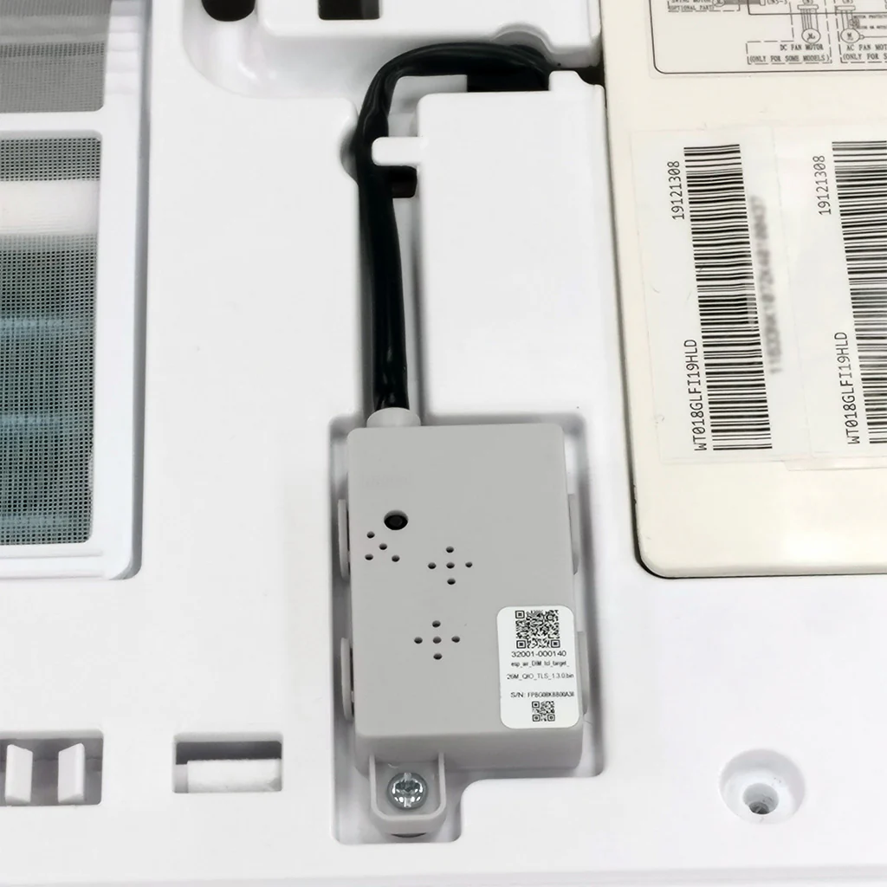
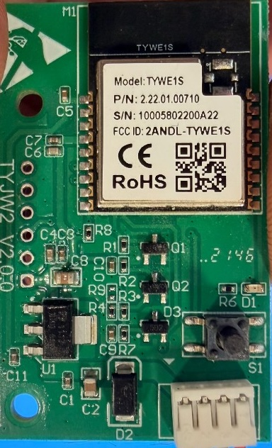
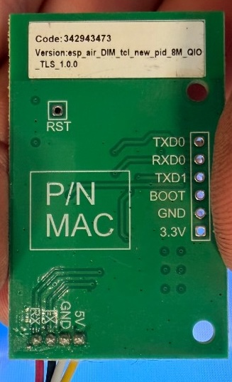

# Pioneer WYT ESPHome Component






## Tested Units

- **Vtronix Classic America** 12000 BTU Smart Mini Split AC/Heat Pump, 19 SEER2

Should work with other units using the same [TST-DIAWIFITPD WiFi module](https://www.pioneerminisplit.com/products/wireless-internet-access-control-module-for-pioneer-diamante-series-systems) or similar Tuya-based modules with the BB protocol (9600 baud, 8E1).

## What It Does

- Full climate control (mode, temp, fan)
- Eco, Turbo, Quiet, Strong, Sleep
- Display and beep toggle
- Vertical/horizontal swing with position control
- Health/Ion
- Sensors: indoor/outdoor temps, compressor freq, coil temps, fan speeds, current draw

## Installation

### Option 1: Copy the component

Copy `esphome/components/pioneer_minisplit/` to your ESPHome config folder.

### Option 2: Use as external component

```yaml
external_components:
  - source:
      type: git
      url: https://github.com/KyleTeal/pioneer-wyt-esphome
      ref: main
    components: [pioneer_minisplit]
```

## Configuration

Copy `example.yaml` to your ESPHome configs and customize it. Requires a `secrets.yaml` with your WiFi credentials and API keys. See `secrets.yaml.example`.

## Climate Entity

Creates a climate entity with:
- **Modes:** Off, Cool, Heat, Dry, Fan Only, Auto
- **Fan:** Auto, Quiet, Low, Medium, High, Strong
- **Presets:** Eco, Boost (Turbo), Sleep (Standard only)
- **Swing / sleep selects:** Vertical and horizontal swing positions; optional `sleep_select` for DP 105 modes (Standard, Elderly, Child)

## Switches

| Switch | What it does |
|--------|--------------|
| Display | Unit display on/off |
| Beep | Beep sounds on/off |
| Health/Ion | Ionizer |

## Protocol Docs

See [reference/PROTOCOL.md](reference/PROTOCOL.md) for the byte-level details if you want to understand or extend this.

## Credits

- [mikesmitty/esphome-components](https://github.com/mikesmitty/esphome-components/tree/main/components/pioneer) - Pioneer Diamante component, outdoor unit status logic
- [bb12489/wyt-dongle](https://github.com/bb12489/wyt-dongle) - BB protocol documentation
- [squidpickles/tuya-serial](https://github.com/squidpickles/tuya-serial) - Protocol research
